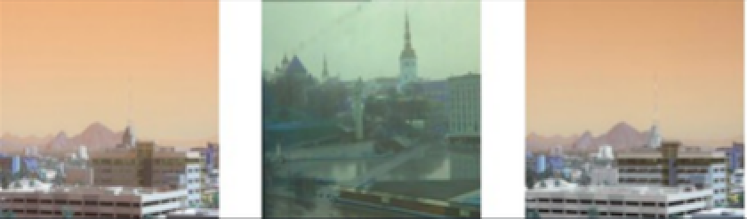

# Round-the-Clock Image Translation

This repository implements a CycleGAN-based approach for converting daytime images to nighttime and vice versa. The project demonstrates unpaired image-to-image translation using deep generative models.

---

## Features
- **Day-to-Night Conversion**: Translates daytime images to nighttime scenes.
- **Night-to-Day Conversion**: Translates nighttime images to daytime scenes.
- **Cycle Consistency**: Ensures the original image can be reconstructed from the translated image.
- **Custom Dataset Support**: Easily train on your own dataset.

---

## Project Structure
```
DayNightImageTranslation/
├── notebooks/           # Jupyter notebooks
├── results/             # Output images and logs
├── README.md            # Project documentation
└── requirements.txt     # Python dependencies
```

---

## Dataset

The project uses the [DayNight Dataset](https://www.kaggle.com/datasets/stevemark/daynight-dataset), which contains:
- **17 categories** of images captured at various intervals during the day and night.
- **1722 total images**, with equal distribution for training and testing.

The entire dataset was used for training and testing without excluding any major portion.

### Data Preprocessing
1. **Data Cleaning**: Removed noisy and unwanted images.
2. **Dataset Organization**: Organized into `day` and `night` folders.
3. **Equalization**: Balanced the number of images in each category.

---

## Getting Started

### Prerequisites
- Python 3.8 or later
- GPU with CUDA support (optional but recommended)

### Installation
1. Clone the repository:
   ```bash
   git clone https://github.com/your-username/DayNightImageTranslation.git
   cd DayNightImageTranslation
   ```

2. Install dependencies:
   ```bash
   pip install -r requirements.txt
   ```

---

## Notebooks

This project includes a Jupyter Notebook for detailed experimentation and analysis:
- **[DayNightTranslation.ipynb](notebooks/DayNightTranslation.ipynb)**: Contains the full implementation of the CycleGAN model, including training and testing workflows. To run the notebook:
  ```bash
  jupyter notebook notebooks/DayNightTranslation.ipynb
  ```

---

## Example Results

| Input (Day) | Output (Night) |
|-------------|----------------|
|  |  |

---

## Metrics

The following metrics were used to evaluate the model:
- **Structural Similarity Index Measure (SSIM)**: Measures structural resemblance between images.
- **Peak Signal-to-Noise Ratio (PSNR)**: Evaluates the ratio between the maximum signal and noise.

Higher SSIM and PSNR values indicate better image quality and resemblance.

---

## Acknowledgments
This project leverages the [CycleGAN](https://github.com/junyanz/pytorch-CycleGAN-and-pix2pix) framework for unpaired image-to-image translation. Special thanks to the contributors of the [DayNight Dataset](https://www.kaggle.com/datasets/stevemark/daynight-dataset).

---
